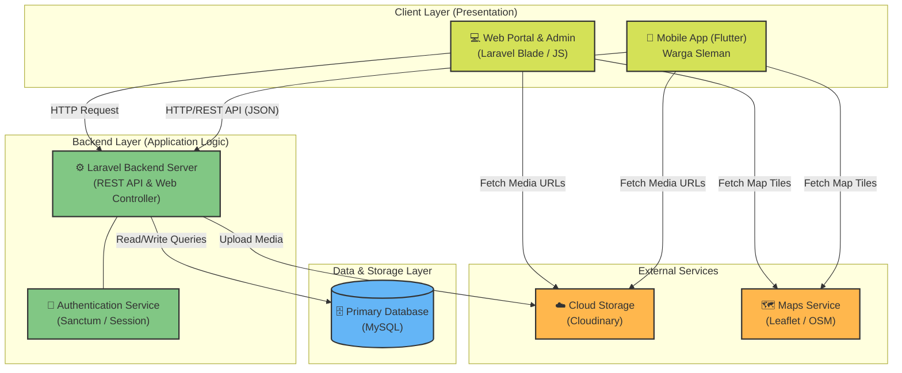

# Arsitektur Sistem Sleman Akses

Dokumen ini menjelaskan arsitektur keseluruhan dari sistem **Sleman Akses**, yang mencakup platform Mobile dan Web, serta interaksi antar layanannya.

## 1. Deskripsi Arsitektur Sistem

Arsitektur sistem Sleman Akses dibangun menggunakan pola **Client-Server** yang berpusat pada backend (Laravel) yang melayani API untuk aplikasi mobile dan me-render halaman untuk web administrator/portal publik.

Sistem ini terbagi menjadi tiga lapisan (layer) utama:

### A. Client Layer (Presentation)
Lapisan ini adalah antarmuka yang berinteraksi langsung dengan pengguna (warga dan administrator).
*   **Mobile Application (Flutter):** Aplikasi mobile yang digunakan oleh warga Sleman. Dibangun menggunakan framework Flutter (Dart) untuk mendukung multi-platform (Android/iOS). Berkomunikasi dengan sistem utama melalui RESTful API. Fitur utamanya mencakup pelaporan, eksplorasi fasilitas, dan peta interaktif.
*   **Web Portal & Admin Dashboard (Laravel Blade / JavaScript):** Aplikasi berbasis web yang digunakan untuk dua tujuan utama: landing page (publik) dan panel administrasi. Admin menggunakan dashboard ini untuk memonitor laporan, mengelola data spasial (peta interaktif), dan manajemen pengguna. Antarmuka menggunakan Blade templating engine, Tailwind/CSS, dan JavaScript murni.

### B. Backend Layer (Application / Logic)
Lapisan ini adalah otak dari sistem yang memproses logika bisnis dan melayani permintaan dari *Client Layer*.
*   **Backend Server (Laravel / PHP):** Framework Laravel bertindak sebagai pusat layanan. Untuk aplikasi Web, Laravel langsung me-render tampilan (Server-Side Rendering). Untuk aplikasi Mobile, Laravel mengekspos RESTful API endpoint yang mengembalikan data dalam format JSON.
*   **Authentication & Session Management:** Mengelola sesi untuk pengguna Web (biasanya melalui cookie/session) dan autentikasi berbasis token (seperti Laravel Sanctum) untuk pengguna Mobile.

### C. Data & Infrastructure Layer
Lapisan tempat penyimpanan data dan aset yang digunakan oleh sistem.
*   **Primary Database (MySQL):** Basis data relasional yang menyimpan semua entitas sistem, seperti data pengguna, laporan warga, koordinat lokasi, dan pengaturan sistem.
*   **Cloud Storage (Cloudinary):** Layanan pihak ketiga yang digunakan untuk menyimpan aset media statis dan dinamis, seperti gambar laporan warga atau foto profil, yang diunggah baik dari Web maupun Mobile.
*   **Maps & Geolocation Service (Leaflet/OSM):** Layanan pemetaan pihak ketiga yang digunakan oleh Web dan Mobile untuk menampilkan komponen Peta Interaktif.

---

## 2. Prompt Mermaid AI (Untuk Excalidraw / Draw.io)

Anda dapat menyalin kode Mermaid di bawah ini ke dalam plugin Mermaid di **Excalidraw** atau **Draw.io** untuk secara otomatis membuat diagram arsitekturnya.

### Cara Menggunakannya:

**Di Excalidraw:**
1. Buka [excalidraw.com](https://excalidraw.com/).
2. Di menu atas (atau menu kiri), klik tombol **More tools** -> **Mermaid...** (atau tekan Insert).
3. Copy dan paste block kode `mermaid` di atas ke dalam kolom teks yang disediakan.
4. Klik **Insert** untuk meletakkan diagramnya di kanvas Anda. Anda bisa menyesuaikan warna atau garis setelahnya.

**Di Draw.io (Diagrams.net):**
1. Buka [app.diagrams.net](https://app.diagrams.net/).
2. Di menu atas, pilih **Arrange** -> **Insert** -> **Advanced** -> **Mermaid**.
3. Hapus contoh kode yang ada, lalu paste kode di atas.
4. Klik **Insert** dan diagram akan muncul secara otomatis.
